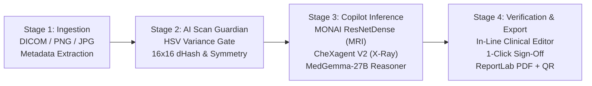

# MedScan AI — AI Radiology Copilot

[](LICENSE)
[](https://fastapi.tiangolo.com)
[](https://react.dev)
[](https://tailwindcss.com)
[](https://github.com/Mangesh-gupta/MedScan-AI)

> **AI-Powered Multi-Modality Radiology Copilot platform featuring automated medical scan validation, specialized deep learning diagnostics (MONAI, CheXagent, MedGemma), and interactive clinical report generation with digital sign-off.**

---

## 📌 Overview

**MedScan AI** is an end-to-end intelligent diagnostic assistant designed to streamline clinical workflows for radiologists and clinicians. It provides rapid, verified analysis across multiple imaging modalities (Brain MRI, Lung MRI, Chest X-Ray, Knee X-Ray), automatically detects and flags non-medical uploads, stages pathological findings, and generates tamper-evident, hospital-grade PDF/DOCX diagnostic reports.

---

## 🔬 Multi-Model Responsibility Matrix

| Model / Subsystem | Modality Coverage | Architectural Role | Diagnostic Capabilities | Latency |
| :--- | :--- | :--- | :--- | :--- |
| **AI Scan Guardian** | All Uploads | Pre-Validation Gate | Rejects non-medical images via HSV variance; matches $16\times16$ structural dHash against reference anchors | **< 50ms** |
| **MONAI ResNetDense** | Brain MRI, Lung MRI | Volumetric / Cross-Sectional Vision | Midline shift quantification ($4.5\text{ mm}$), WHO Grade IV glioblastoma staging, SUV uptake measurements | **< 1.2s** |
| **CheXagent Stanford V2**| Chest X-Ray, Knee X-Ray | Radiographic Transformer | Cardiothoracic ratio ($CTR < 0.50$), peribronchial cuffing detection, Kellgren-Lawrence knee OA grading | **< 1.0s** |
| **MedGemma-27B Reasoner**| Multi-Modal Synthesis | Clinical LLM Synthesizer | Synthesizes vision findings into structured 6-point anatomical reports, differential impression, and ACR follow-up | **< 30s** |
| **ReportLab Engine** | Signed Export | Cryptographic Vector Document | Emits hospital-grade A4 PDF & DOCX reports with digital signature, verification hash, and SVG QR verification | **Instant** |

---

## 🔄 Clinical & Engineering Pipeline



---

## 🩻 Key Features

- **Multi-Modality Ingestion**: Full support for Brain MRI, Lung MRI, Chest X-Ray, and Knee X-Ray formats (DICOM, JPG, PNG).
- **Intelligent Pre-Validation**: Prevents hallucinations by rejecting non-medical photos before inference begins.
- **Interactive Report Workspace**: Radiologists can inspect scans with zoom/pan controls, edit findings and impression in real time.
- **1-Click Digital Sign-Off**: Securely locks reports, assigns a verification hash, and generates exportable hospital-ready documents.
- **Comprehensive Archives & Analytics**: Searchable history of past studies, approval statuses, and modality distribution metrics.

---

## 🖥️ System Requirements

| Tool | Version | Download |
| :--- | :--- | :--- |
| **Python** | 3.10 or higher | [python.org](https://www.python.org/downloads/) |
| **Node.js** | 18 LTS or higher | [nodejs.org](https://nodejs.org/) |

> ⚠️ **Important:** During Python installation, ensure the box **"Add Python to PATH"** is checked.

---

## 🚀 Quick Start Guide

### 1. First-Time Setup
Double-click `SETUP.bat` or run:
```bash
# Install backend dependencies
cd backend
python -m pip install -r requirements.txt
python seed_data.py

# Install frontend dependencies
cd ../frontend
npm install
```

### 2. Launch the Application
Double-click `START_APP.bat` (or `start_medscan.bat`) or run:
```bash
# Terminal 1: Backend
cd backend && python run.py

# Terminal 2: Frontend
cd frontend && npm run dev
```

---

## 🔗 Application Access

| Component | Default URL | Description |
| :--- | :--- | :--- |
| **Frontend UI** | [http://localhost:5173](http://localhost:5173) | Interactive Clinical Dashboard & Viewer |
| **Backend API** | [http://127.0.0.1:8000](http://127.0.0.1:8000) | FastAPI REST Endpoints |
| **Swagger Docs** | [http://127.0.0.1:8000/docs](http://127.0.0.1:8000/docs) | Interactive API Documentation |

---

## 📁 Repository Structure

```
MedScan-AI/
├── SETUP.bat                        # One-click environment bootstrap
├── START_APP.bat                    # One-click unified service launcher
├── start_medscan.bat                # Direct MedScan AI launcher
├── backend/
│   ├── run.py                       # FastAPI entry point
│   ├── seed_data.py                 # Seeds mock clinical database
│   ├── requirements.txt             # Python backend dependencies
│   ├── app/                         # Backend API, AI router & export engine
│   └── visionguard360.db            # SQLite clinical storage
├── frontend/
│   ├── src/                         # React + TypeScript clinical UI
│   ├── package.json                 # Node frontend dependencies
│   └── vite.config.ts               # Vite build configuration
└── VisionGuard/
    └── MedScanAI_Radiology_Copilot.pptx # Technical Architecture Presentation
```

---

## 📄 License

This project is licensed under the MIT License — see the [LICENSE](LICENSE) file for details.

